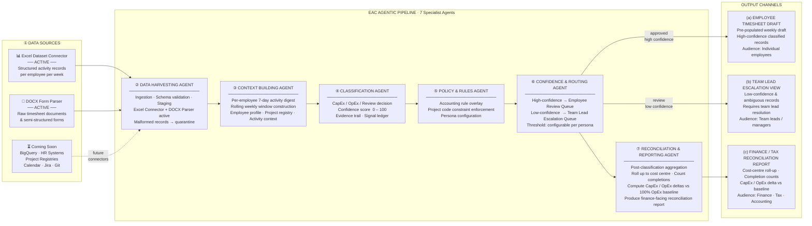

# EAC Labor Timesheets
## Architecture and Design Document

**Submission:** UC-2 Project Coder Weekly Timesheet Pre-Population  
**Application:** EAC Labor Timesheets  
**Date:** May 25, 2026  
**Version:** 1.0  

---

## 1. Problem Statement Analysis

### 1.1 Business Problem

Project-coding employees are asked to reconstruct weekly labor allocations across project codes and activity types. The current process relies on memory, often days after the work occurred. That produces inaccurate timesheets, weak evidence for capitalization decisions, and avoidable loss of capitalizable labor.

The app addresses the problem by pre-populating a weekly timesheet draft from structured activity data and observable work signals. The employee or team lead reviews the proposed allocation, corrects exceptions, and submits the result. The system changes the user task from authoring a timesheet from memory to confirming a data-backed draft.

### 1.2 Financial Context

CapEx / OpEx labor classification directly affects capitalization treatment and operating expense reporting. Treating capitalizable labor as OpEx permanently loses capitalization opportunity. Over-classifying labor as CapEx creates audit and compliance risk. The system therefore must be both helpful and conservative:

- high-confidence records flow to employee review,
- ambiguous records route to team leads,
- every decision has evidence and confidence,
- every correction is logged.

### 1.3 POC Scope

The POC demonstrates:

- Excel dataset ingestion,
- DOCX or DOCX ZIP timesheet parsing,
- canonical schema normalization,
- deterministic CapEx / OpEx / Review classification,
- confidence routing,
- employee-level weekly review,
- team-lead review queue,
- audit trace,
- connector catalog,
- feedback learning view,
- analytics and overview reporting,
- reconciliation and reporting: cost-centre roll-up, CapEx/OpEx delta vs 100% OpEx baseline, hierarchical drill-down (cost centre → job title → employee → project).

### 1.4 Key Constraints

| Constraint | Architectural Impact |
| --- | --- |
| Engine must be source-agnostic | All connectors normalize into one canonical activity schema before classification |
| Weekly mode is required | Records are grouped by employee and week for review and drafting |
| Low-confidence must not go to employees | Confidence routing sends uncertain records to Review Queue |
| DOCX extraction must be validated | Form Extraction Validation compares parsed forms against Excel records |
| Corrections must be logged | Override, employee edit, and submit events are persisted to audit |
| POC must be easy to run | Local FastAPI, Next.js, and SQLite are used |
| Production must be explainable | Agent trace, evidence ledger, rule version, and provenance are surfaced |

---

## 2. Architecture Overview

### 2.1 Logical Architecture

```text
[User Browser]
     |
     v
[Next.js Frontend]
     |
     | REST API
     v
[FastAPI Backend]
     |
     +--> [Upload API]
     |        |
     |        v
     |   [Ingestion Job Service]
     |        |
     |        v
     |   [Flow Orchestrator]
     |        |
     |        +--> [Excel Connector]
     |        +--> [DOCX / ZIP Connector]
     |        |
     |        v
     |   [Canonical Normalization]
     |        |
     |        v
     |   [LangGraph Agent Pipeline]
     |        |
     |        +--> Harvesting
     |        +--> Context
     |        +--> Retrieval
     |        +--> Policy
     |        +--> Classification
     |        +--> Routing
     |        +--> Reconciliation & Reporting
     |        |
     |        v
     |   [Persistence + Audit Events]
     |
     +--> [Records / Summary / Drafts / Escalations / Audit APIs]
              |
              v
        [SQLite POC Database]
```

### 2.2 Runtime Layers

| Layer | POC Implementation | Responsibility |
| --- | --- | --- |
| User surface | Next.js single-page app | Screens, filters, employee review, audit visualization |
| API layer | FastAPI routers | Records, upload, jobs, drafts, escalations, overrides, audit |
| Ingestion | Upload routes + job service | Stage files, run sync, expose progress |
| Connector framework | ExcelConnector, DocxConnector | Extract and normalize source-specific data |
| Orchestration | FlowOrchestrator | Sequence extraction, validation, classification, persistence |
| Agent pipeline | LangGraph + AgenticPipeline | Context, retrieval, policy, classification, routing trace |
| Rules engine | Hybrid classifier and accounting rules | Deterministic CapEx / OpEx / Review output |
| Persistence | SQLAlchemy + SQLite | Records, runs, ingestion jobs, audit events |
| Audit | AuditService | Classification and correction event history |

### 2.3 Production Target Architecture

The same logical boundaries map cleanly to production infrastructure:

| POC | Production Replacement |
| --- | --- |
| Next.js local dev server | Vercel, CDN, or enterprise web hosting |
| FastAPI local process | Containerized API service |
| SQLite | PostgreSQL with migrations and HA |
| Local file upload processing | Object storage staging |
| In-process job worker | Managed queue and autoscaled workers |
| Local audit events | Immutable append-only audit/event archive |
| Stub semantic retrieval | Vector store over approved precedents |
| Public no-login UI | SSO/RBAC with employee, lead, finance, admin roles |

---

## 3. Agentic Workflow Diagram

> **Standalone deliverable (REQ-53).** This diagram is self-explanatory and does not require supporting text. It covers all seven pipeline stages and all three output channels as required by the May 22 stakeholder addendum.



### Agent Responsibilities

| Stage | Agent | What it does | Output |
| --- | --- | --- | --- |
| ① | Data Sources | Two active connectors: Excel dataset (structured records) and DOCX Form Parser (raw timesheet documents). Coming Soon: BigQuery, HR systems, project registries. | Normalised canonical activity records |
| ② | Data Harvesting Agent | Ingests records from active connectors, enforces schema contract, validates required fields, stages clean records. Malformed records are quarantined before they enter the pipeline. | Validated record payload or quarantine event |
| ③ | Context Building Agent | Constructs a per-employee 7-day activity digest using a rolling weekly window. Assembles employee profile, project registry metadata, and activity-type context for downstream agents. | Enriched context bundle |
| ④ | Classification Agent | Produces the primary CapEx / OpEx / Review decision with a 0–100 confidence score, a human-readable evidence trail, and a structured signal list. | `_classification`, `_confidence`, `_evidence`, `_signals` |
| ⑤ | Policy & Rules Agent | Applies accounting rule overlay: fixed-asset rules, project code constraint enforcement, persona configuration. Adds rule version and matched-rule evidence to the record. | Rule-adjusted record, rule version, policy evidence |
| ⑥ | Confidence & Routing Agent | Bifurcates the record stream: high-confidence approved records go to the Employee Review Queue; low-confidence records route to the Team Lead Escalation Queue. Threshold is configurable per persona. | `_routingState`: `approved` or `review` |
| ⑦ | Reconciliation & Reporting Agent | Post-classification aggregation: rolls up to cost centre, counts completions and outstanding submissions, computes CapEx / OpEx deltas vs 100% OpEx baseline, produces the Finance / Tax Reconciliation Report. | Cost-centre reconciliation report |

---

## 4. Component Architecture

### 4.1 Frontend

The frontend is a Next.js app implemented primarily in `frontend/app/page.tsx` and styled through `frontend/app/globals.css`.

#### Main Screens

| Screen | Responsibility |
| --- | --- |
| Overview | Aggregate CapEx / OpEx summary and project-level visuals |
| Activity Records | Canonical row-level table with expansion, filters, pagination, overrides |
| Review Queue | Team-lead low-confidence record resolution |
| Employee Review | Employee review-and-confirm packet with editable weekly data |
| Employee Directory | Employee-level timesheet history and contribution analysis |
| Analytics | KPI cards, CapEx spend by project, weekly CapEx vs OpEx stacked bars, Early Insights panel (REQ-58/59) |
| Reconciliation | 4-level hierarchical roll-up: cost centre → job title → employee → project; finance-facing report with CapEx/OpEx deltas, completion counts, and production integration note (REQ-54–56) |
| Audit Trail | Event timeline, classification trace, and agent pipeline evidence |
| Data Sources | Connectors, pipeline contract, and form validation |
| Feedback Learning | Correction log, calibration candidates, and governed learning loop |

#### Frontend State

The frontend loads:

- summary metrics,
- records,
- weekly drafts,
- escalations,
- connector status,
- audit events.

Most interactions use REST calls against the FastAPI backend. UI state is kept local to the app for selected tab, filters, selected employee, selected record, search terms, and expanded rows.

### 4.2 Backend API

The backend exposes a REST API through FastAPI.

#### Classification Routes

| Endpoint | Purpose |
| --- | --- |
| `GET /api/records` | List normalized classified records |
| `GET /api/records/run/{run_id}` | Stream or fetch records from a specific run |
| `GET /api/runs/latest` | Latest ingestion/classification run metadata |
| `GET /api/summary` | Dashboard summary metrics |
| `GET /api/drafts` | Employee weekly review packets |
| `POST /api/drafts/submit` | Submit reviewed employee lines |
| `GET /api/escalations` | Review Queue items |
| `GET /api/connectors` | Connector status and metrics |
| `GET /api/audit/{record_uid}` | Audit events for a record |
| `POST /api/records/{record_uid}/override` | Team-lead classification override |
| `PATCH /api/records/{record_uid}` | Employee review edits |
| `GET /api/reconciliation` | Cost-centre reconciliation report with 4-level hierarchical roll-up (REQ-54–56) |

#### Upload Routes

| Endpoint | Purpose |
| --- | --- |
| `POST /api/upload/excel` | Stage Excel workbook ingestion |
| `POST /api/upload/forms` | Stage one DOCX file or DOCX ZIP ingestion |
| `GET /api/upload/jobs/{job_id}` | Poll ingestion progress and outcome |

### 4.3 Connector Framework

Connectors own source-specific extraction. They do not classify records.

#### Connector Contract

Each connector must:

1. Extract raw records from a source.
2. Normalize raw values into the canonical schema.
3. Validate required fields and value consistency.
4. Attach source provenance.
5. Return records suitable for the classification pipeline.

#### Excel Connector

Responsibilities:

- Read workbook sheets through pandas.
- Select the dataset sheet.
- Preserve workbook definition/mapping rows where present.
- Normalize row values.
- Validate required fields.
- Validate employee-week hours against actual working days.
- Attach full raw fields for audit.

#### DOCX Connector

Responsibilities:

- Accept one `.docx` or a `.zip` containing `.docx` files.
- Skip temporary Word files.
- Extract paragraphs and table text.
- Parse employee identity, job context, week dates, attendance fields, notes, project lines, activity types, and hours.
- Normalize dates and numeric fields.
- Produce one canonical record per timesheet line.
- Deduplicate records by stable key.
- Compute extraction confidence.

### 4.4 Orchestration

The `FlowOrchestrator` coordinates the full run:

1. Create run id.
2. Extract records through the active connector.
3. Normalize and validate records.
4. Quarantine invalid records.
5. Classify valid records through the agentic pipeline.
6. Match DOCX forms against Excel keys when available.
7. Persist records.
8. Write audit events.
9. Push progress records to the progress store.
10. Write run manifest.

The orchestrator supports both Excel and DOCX/ZIP using the same downstream classification path.

### 4.5 Agent Pipeline

The app uses a LangGraph state graph with seven nodes (REQ-54):

```text
Harvesting -> Context -> Retrieval -> Policy -> Classification -> Routing -> Reconciliation -> END
```

| Agent Node | Responsibility |
| --- | --- |
| Harvesting | Accept normalized record and enforce basic field contract |
| Context | Build employee, week, project, and activity context |
| Retrieval | Attach semantic precedent or historical pattern context |
| Policy | Apply fixed asset and project-coder rule context |
| Classification | Produce CapEx / OpEx / Review, confidence, and evidence |
| Routing | Determine employee review versus team-lead review state |
| Reconciliation & Reporting | Stamp record with cost-centre metadata; aggregate to cost centre level; compute CapEx/OpEx delta vs 100% OpEx baseline; produce finance-facing report (REQ-54–56) |

The UI audit view displays this as an EAC-style Agent Pipeline Trace.

### 4.6 Classification Engine

The classification engine is policy-led and hybrid:

- deterministic rules provide the authoritative decision path,
- signal weighting influences confidence and evidence,
- LLM outputs enrich context where configured,
- uncertain outcomes are routed to review.

Classification outputs include:

- classification,
- confidence,
- evidence summary,
- review reason,
- signal list,
- rule version,
- routing state,
- agent trace.

### 4.7 Persistence Model

The POC uses SQLAlchemy-backed SQLite. Core stored entities include:

| Entity | Purpose |
| --- | --- |
| ActivityRecord | Normalized source payload plus classification output |
| BatchRun | Run manifest and connector run summary |
| IngestionJob | Upload/run-sync job state |
| AuditEvent | Append-style event history for records |

The serialized record payload stores canonical fields and source metadata, while model columns store core classification and provenance fields for queries.

---

## 5. Data Architecture

### 5.1 Canonical Record Shape

The canonical activity record is the core interface between connectors and the engine.

```text
employee_id
full_name
job_title
job_family
team_name
org_unit
manager_id
week_start_date
week_end_date
standard_days
holiday_days
pto_days
sick_days
actual_working_days
project_code
project_name
activity_type
hours_allocated
meeting_count
ticket_count
email_volume
code_commit_count
system_activity_score
submission_notes
source metadata
classification metadata
```

### 5.2 Record Identity

Records use stable keys derived from employee, week, project, and activity context. This supports:

- DOCX-to-Excel matching,
- deduplication,
- audit linking,
- replay comparison,
- employee-week grouping.

### 5.3 Employee Weekly Drafts

The `/api/drafts` response groups high-confidence or resolved records by:

```text
employee_id + week_start_date
```

The frontend then groups those weekly drafts by employee for Employee Review and Employee Directory.

Each draft contains:

- employee context,
- week range,
- attendance values,
- total hours,
- CapEx hours,
- OpEx hours,
- capitalization percentage,
- estimated recovery,
- line items.

### 5.4 Review Queue Records

Review Queue groups low-confidence records by manager/team-lead context. A record appears in the queue when:

- effective classification is `Review`, or
- confidence is below threshold and no human override has resolved it.

### 5.5 Audit Events

Audit events are created for:

- quarantined records,
- classified records,
- team-lead overrides,
- employee review updates,
- employee draft submissions.

The audit payload stores enough context to reconstruct the decision trace and human correction history.

---

## 6. User Experience Architecture

### 6.1 Overview

Overview is the executive and finance reviewer entry point. It summarizes:

- records processed,
- hours by classification,
- project code capitalization,
- trends,
- estimated recovery.

### 6.2 Activity Records

Activity Records is the canonical data inspector. It provides:

- project filter,
- date filter,
- class tabs,
- pagination,
- expanded details,
- manual override,
- evidence and confidence display.

### 6.3 Review Queue

Review Queue is for team leads, not employees. It exposes:

- low-confidence records,
- classification context,
- full detail expansion,
- action controls,
- audit linkage.

### 6.4 Employee Review

Employee Review is the editable employee packet:

- sorted by employee ID,
- fuzzy search,
- best-match auto-selection,
- all weeks in one employee view,
- editable holiday/PTO/sick values per week,
- editable classification/project code/notes per line,
- save changes,
- submit draft.

### 6.5 Employee Directory

Employee Directory mirrors the Employee Review search/list behavior but is read-optimized:

- employee timesheet history,
- project mix,
- activity mix,
- CapEx / OpEx contribution,
- attendance context,
- audit links.

### 6.6 Data Sources

Data Sources has three subtabs:

1. Connectors
2. Classification Pipeline
3. Form Extraction Validation

This supports demo flow, connector governance, and extraction QA.

---

## 7. Security and Governance Architecture

### 7.1 POC State

The current POC is a no-login local application. It is suitable for assessment/demo use but not for production employee financial data without added controls.

### 7.2 Production Roles

| Role | Access |
| --- | --- |
| Employee | Own review packet and submitted history |
| Team Lead | Review queue for direct/assigned team |
| Finance Reviewer | All records, audit, analytics, connector status |
| Admin | Connector configuration, rule versions, ingestion jobs |
| Platform Operator | Infrastructure, logs, deployment, secrets |

### 7.3 Production Controls

Production should add:

- SSO/RBAC,
- row-level access filtering,
- immutable audit archive,
- encrypted object storage,
- secrets manager,
- network-private database,
- retention policies,
- read-access logging,
- rule and prompt version approval.

---

## 8. Reliability Architecture

### 8.1 Failure Handling

| Failure | Current Behavior |
| --- | --- |
| Bad row quality | Quarantine as Review with reason |
| Missing required field | Validation error and lower confidence/review path |
| DOCX extraction confidence below floor | Validation error |
| LLM/pipeline exception | Route to Review with error evidence; stub fallback returns empty enrichment strings so no misleading "unavailable" text appears in user-facing evidence |
| Upload job failure | Job status exposes failed state and error |
| Low confidence | Review Queue |

### 8.2 Idempotency and Replay

The system preserves:

- run id,
- source file,
- source record id,
- stable record key,
- raw fields,
- normalized fields,
- rule version.

These fields support replay and comparison across runs.

### 8.3 Progress Visibility

Upload jobs expose:

- status,
- stage,
- processed count,
- classified count,
- escalated count,
- failed count,
- matched Excel count.

This prevents silent long-running sync behavior.

---

## 9. Production Deployment Path

### 9.1 Recommended Services

| Capability | Recommended Production Service |
| --- | --- |
| Frontend | Vercel, Azure Static Web Apps, or enterprise CDN |
| API | Containerized FastAPI |
| Worker | Autoscaled queue worker |
| Queue | Azure Service Bus, SQS, Pub/Sub, or RabbitMQ |
| Database | PostgreSQL |
| Object storage | Azure Blob, S3, or GCS |
| Secrets | Key Vault, Secrets Manager, or Secret Manager |
| Semantic retrieval | PostgreSQL pgvector or managed vector/search service |
| Audit archive | Append-only event store with retention controls |
| Observability | Application traces, job metrics, audit dashboards |

### 9.2 Separation of API and Worker

Production should split runtime into:

- API container for user requests and read/write actions,
- worker container for ingestion and classification runs.

Both can use the same image but different startup commands. This avoids batch runs blocking interactive API latency.

### 9.3 Batch Operating Model

Production workflow:

1. Scheduler triggers nightly run.
2. Connectors refresh source data.
3. Files are staged in object storage.
4. Job message is placed on queue.
5. Worker normalizes and classifies records.
6. Results are persisted.
7. Employees and leads see updated queues the next morning.

---

## 10. Observability

The system should expose:

- run duration,
- records processed,
- records classified,
- records escalated,
- records quarantined,
- connector failures,
- extraction confidence,
- average classification confidence,
- override rate,
- employee submission rate,
- review queue age,
- LLM call count and failure rate,
- audit event count.

The POC surfaces a subset through connector metrics, summary views, audit events, and feedback learning.

---

## 11. Known Gaps and Production Hardening

| Area | Gap | Production Hardening |
| --- | --- | --- |
| Authentication | No login | SSO/RBAC |
| Data store | SQLite | PostgreSQL with backups, migrations, encryption |
| Audit immutability | Local events mutable by DB admin | Append-only immutable event archive |
| Queue | Local job service | Managed queue with retries and dead-letter |
| File retention | Local upload bytes only during run | Object storage with retention and purge policy |
| Semantic retrieval | Stubbed/generated context | Vector search over approved history |
| LLM governance | Provider config only | Prompt registry, evaluation, monitoring |
| Rules governance | Code version | Policy/rules service with approval workflow |
| Access logging | Limited | Log every protected record read |
| Export/reporting | UI only | Controlled exports with audit watermarks |

---

## 12. Summary

EAC Labor Timesheets is a source-agnostic employee activity classification platform for weekly project-coded labor. Its architecture separates connectors, canonical schema, classification engine, confidence routing, review UX, and audit trail. The POC is local and pragmatic, but it demonstrates the full target workflow:

```text
ingest -> normalize -> classify -> route -> review -> correct -> audit -> learn
```

The key production insight is that the engine must remain deterministic and policy-led while AI assists with extraction, context, evidence, and semantic precedent. This keeps the system useful for employees, safe for finance, and defensible for audit review.
